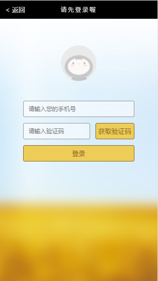

# video-mobile


>使用Html+CSS+Javascript开发web前端，使用node.js开发web后台，完成的一套视频网站Demo 

项目主页 [Github-video-mobile](https://github.com/doctorFei/video-mobile)

## 写在前面
* 本次主要是开发一个移动端的视频展示、预览的H5，打开的第一个页面是《视频分栏目展示列表页面》，这里可以自己造一些假数据来模拟视频信息。  
* 当用户点击视频区域之后，需要在后台检查当前session是否登录，如果未登录，需要跳转到登录页面。  
* 用户提交登录信息之后，web后端在session中保存其登录信息，并返回前台。前端发现用户登录之后，跳转到《视频详情页面》，在《视频详情页面》中，用户可以查看视频信息，并观看视频（支持暂停、进度等）

## 说明
> 由于视频资源有限，所以为了减少寻找视频资源的时间，把所有的视频内容设置成了相同的，但是关于视频的介绍说明不一样
>
> 在视频详情页视频播放部分的视频封面部分的图片比例应该和video标签的长款比相同，因为图片很多，所以未更改图片大小，所以在播放器的封面部分就显示
的不是那么契合
> 


## 实现效果


首页  |登录页| 详情页
:-:|:-:|:-:
 | | 

## 运行项目

**安装依赖**  
```shell
npm install
```
**进入开发模式**
```shell
npm start
之后打开 localhost:3000 并在移动端模式下查看
```
